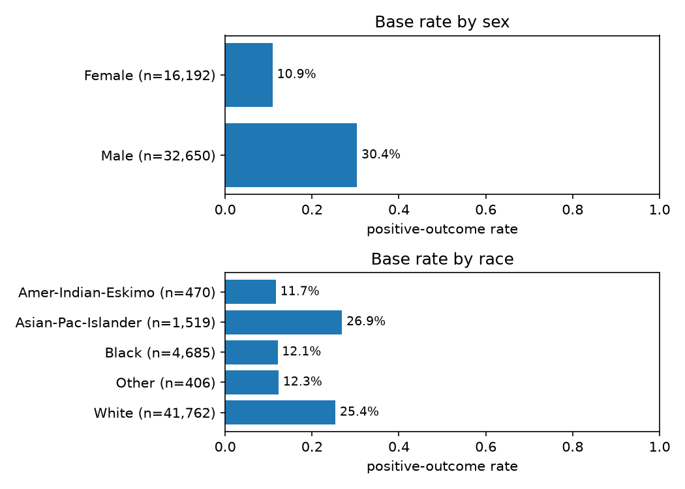
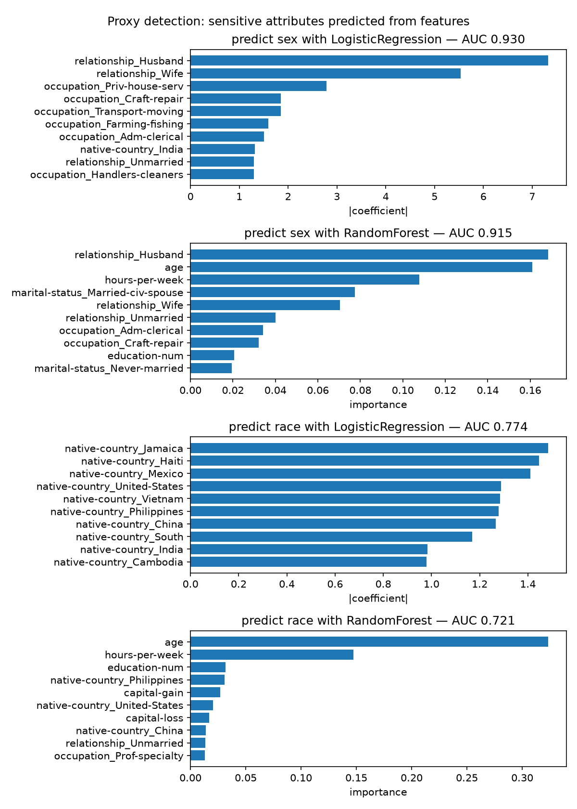
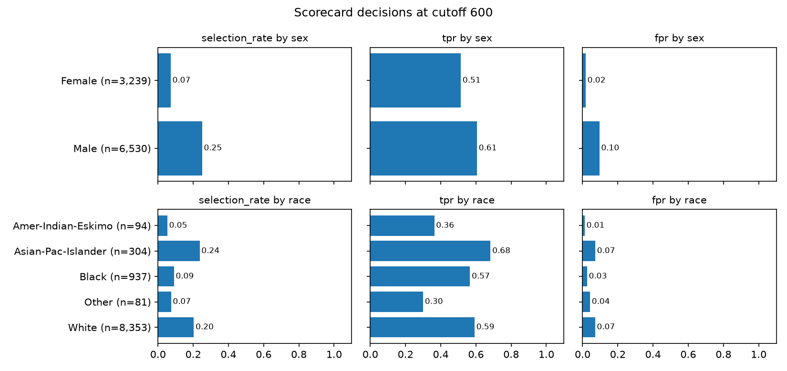
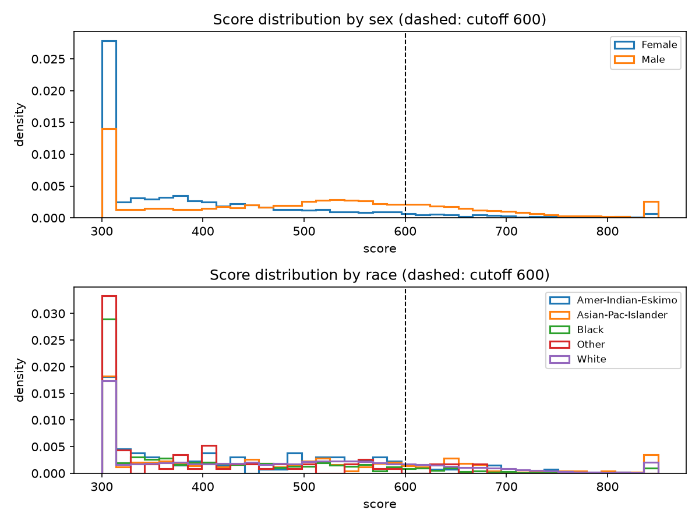
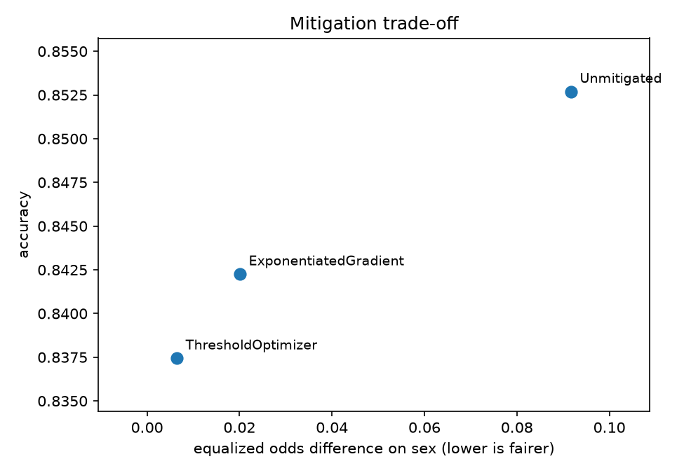
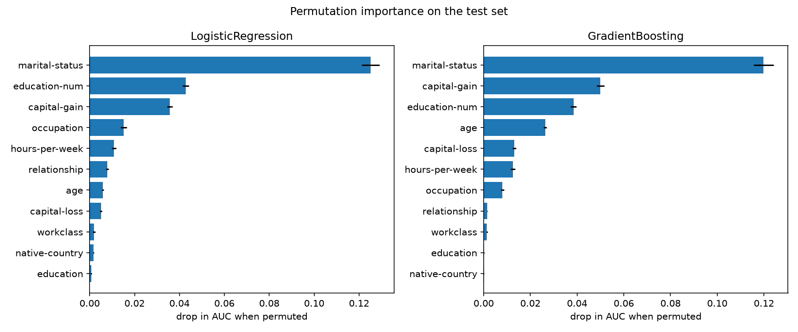
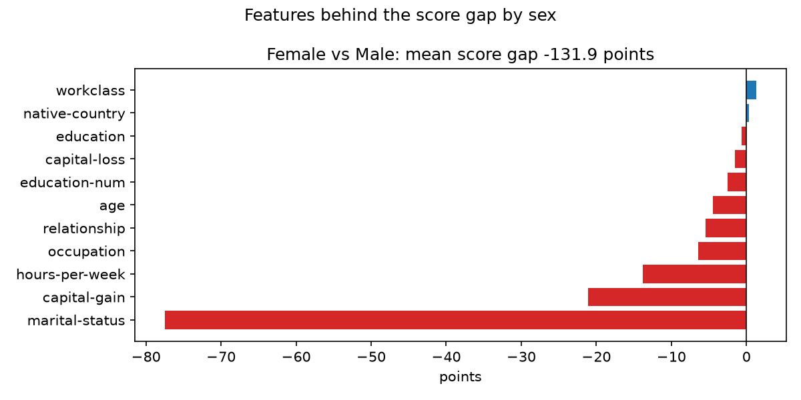

# FairScore audit: adult_census

48,842 rows, 11 features, 23.9% positive. Train 39,073, test 9,769. Sensitive attributes (sex, race) are held out of the features. All numbers below come from the test set unless stated.

## 1. Base rates

Share of positive outcomes in the raw labels, before any model.

| attribute | group | count | positive_rate |
| --- | --- | --- | --- |
| sex | Female | 16192 | 0.109 |
| sex | Male | 32650 | 0.304 |
| race | Amer-Indian-Eskimo | 470 | 0.117 |
| race | Asian-Pac-Islander | 1519 | 0.269 |
| race | Black | 4685 | 0.121 |
| race | Other | 406 | 0.123 |
| race | White | 41762 | 0.254 |

## 2. Proxy detection

Held-out AUC for predicting each sensitive attribute from the model features. 0.5 means the features carry no trace of it. Anything well above that means dropping the column did not remove the information.

| attribute | model | auc | top_features |
| --- | --- | --- | --- |
| sex | LogisticRegression | 0.930 | relationship_Husband, relationship_Wife, occupation_Priv-house-serv |
| sex | RandomForest | 0.915 | relationship_Husband, age, hours-per-week |
| race | LogisticRegression | 0.774 | native-country_Jamaica, native-country_Haiti, native-country_Mexico |
| race | RandomForest | 0.721 | age, hours-per-week, education-num |

## 3. Models

| model | auc | ks | brier | accuracy |
| --- | --- | --- | --- | --- |
| LogisticRegression | 0.904 | 0.639 | 0.102 | 0.853 |
| GradientBoosting | 0.922 | 0.678 | 0.092 | 0.869 |

Scores use 50 points to double the odds, with 600 at odds 1.0:1. Applicants at or above 600 (probability 0.50) are approved.

Largest scorecard weights (numeric points are per standard deviation):

| feature | coefficient | points |
| --- | --- | --- |
| (base points) | -2.01 | 455.14 |
| capital-gain | 2.32 | 167.17 |
| native-country_Columbia | -1.63 | -117.48 |
| marital-status_Married-civ-spouse | 1.45 | 104.37 |
| occupation_Priv-house-serv | -1.28 | -92.05 |
| marital-status_Married-AF-spouse | 1.23 | 89.05 |
| marital-status_Never-married | -1.16 | -83.82 |
| native-country_South | -1.03 | -74.29 |
| native-country_Ireland | 1.03 | 74.07 |
| native-country_Cambodia | 0.95 | 68.83 |
| occupation_Farming-fishing | -0.95 | -68.65 |

## 4. Fairness audit

`dp_ratio` is the lowest group approval rate divided by the highest. Below 0.8 fails the four-fifths rule. `eo_difference` is the larger of the TPR and FPR gaps.

| model | attribute | dp_difference | dp_ratio | eo_difference | passes_four_fifths |
| --- | --- | --- | --- | --- | --- |
| LogisticRegression | sex | 0.179 | 0.287 | 0.092 | no |
| LogisticRegression | race | 0.184 | 0.225 | 0.383 | no |
| GradientBoosting | sex | 0.167 | 0.289 | 0.107 | no |
| GradientBoosting | race | 0.169 | 0.333 | 0.232 | no |

Per-group detail for the scorecard:

| attribute | group | count | selection_rate | tpr | fpr | accuracy | mean_score |
| --- | --- | --- | --- | --- | --- | --- | --- |
| sex | Female | 3239 | 0.072 | 0.514 | 0.018 | 0.931 | 393.957 |
| sex | Male | 6530 | 0.251 | 0.606 | 0.095 | 0.814 | 496.772 |
| race | Amer-Indian-Eskimo | 94 | 0.053 | 0.364 | 0.012 | 0.915 | 422.466 |
| race | Asian-Pac-Islander | 304 | 0.237 | 0.683 | 0.072 | 0.862 | 476.000 |
| race | Black | 937 | 0.091 | 0.566 | 0.025 | 0.925 | 403.782 |
| race | Other | 81 | 0.074 | 0.300 | 0.042 | 0.877 | 386.592 |
| race | White | 8353 | 0.204 | 0.592 | 0.071 | 0.843 | 469.996 |

## 5. Mitigation

Both methods target equalized odds on `sex`. ThresholdOptimizer needs `sex` at decision time. ExponentiatedGradient needs it only in training.

| method | accuracy | approval_rate | dp_difference | dp_ratio | eo_difference | passes_four_fifths |
| --- | --- | --- | --- | --- | --- | --- |
| Unmitigated | 0.853 | 0.191 | 0.179 | 0.287 | 0.092 | no |
| ThresholdOptimizer | 0.837 | 0.161 | 0.090 | 0.527 | 0.006 | no |
| ExponentiatedGradient | 0.842 | 0.174 | 0.106 | 0.493 | 0.020 | no |

## 6. Explanations

Features behind the mean score gap on `sex`. The bars sum to the gap.

Sample reason codes for declined applicants (points lost against the average training applicant):

| applicant | points_vs_average | reason_1 | reason_2 | reason_3 |
| --- | --- | --- | --- | --- |
| 25380 | -35.5 | education-num (-87) | age (-29) | capital-gain (-24) |
| 2829 | 66.7 | marital-status (-75) | capital-gain (-24) | capital-loss (-4) |
| 32979 | -84.4 | marital-status (-93) | relationship (-58) | capital-gain (-24) |
| 202 | 48.1 | marital-status (-60) | capital-gain (-24) | capital-loss (-4) |
| 47904 | 3.8 | marital-status (-93) | workclass (-32) | capital-gain (-24) |
| 22426 | 84.3 | capital-gain (-24) | education-num (-23) | capital-loss (-4) |
| 39733 | 109.9 | capital-gain (-24) | education-num (-23) | occupation (-5) |
| 22545 | 63.3 | capital-gain (-24) | education-num (-23) | capital-loss (-4) |
| 39795 | -225.5 | marital-status (-93) | occupation (-65) | capital-gain (-24) |
| 3566 | 6.3 | marital-status (-60) | capital-gain (-24) | capital-loss (-4) |

## Caveats

- `race=Amer-Indian-Eskimo` has 94 test rows. Its rates move several points on a handful of applicants.
- `race=Other` has 81 test rows. Its rates move several points on a handful of applicants.
- Holding sensitive columns out does not hide them. `sex` is recoverable from the features at AUC 0.93.
- Mitigated predictions are randomized. Rerunning with another random_state shifts the mitigation rows slightly.
