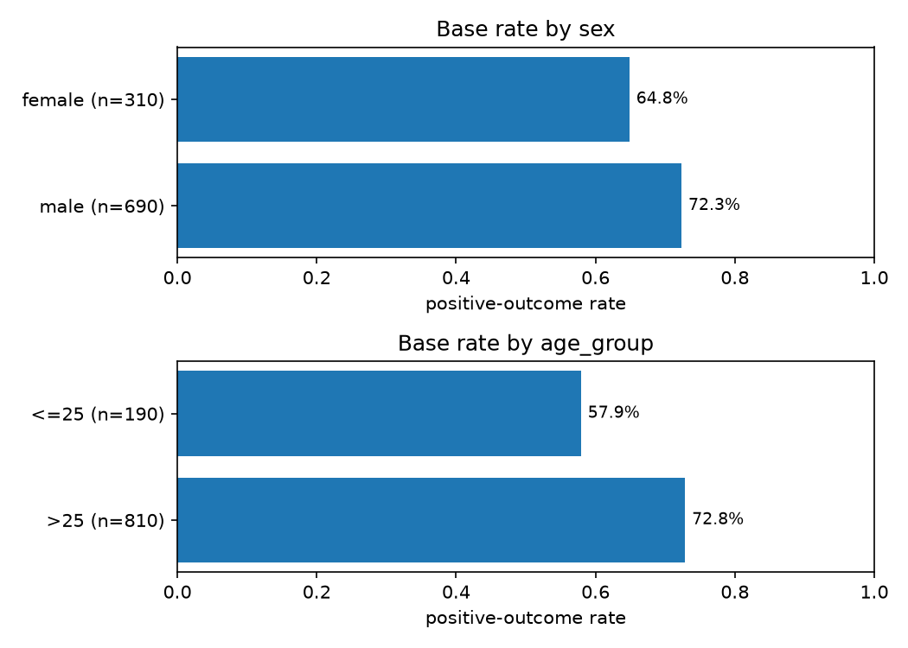
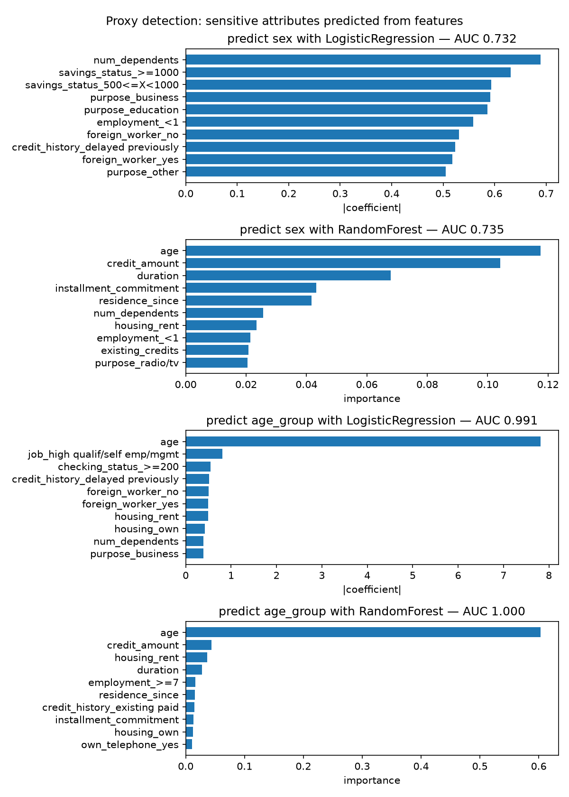
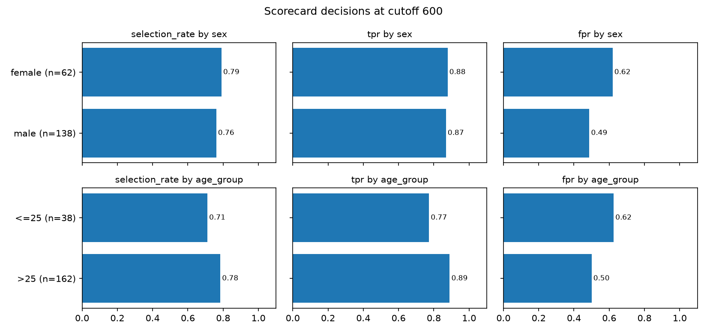
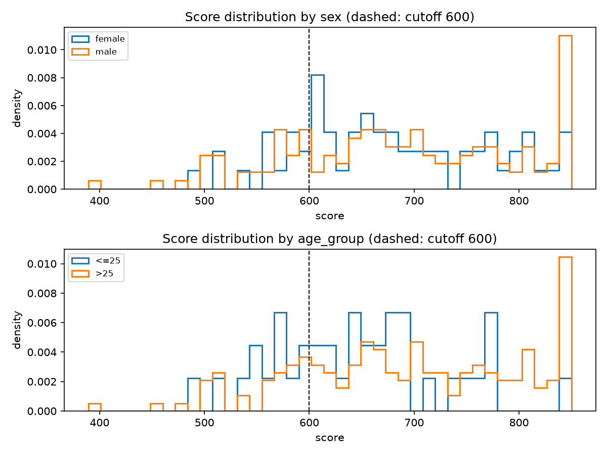
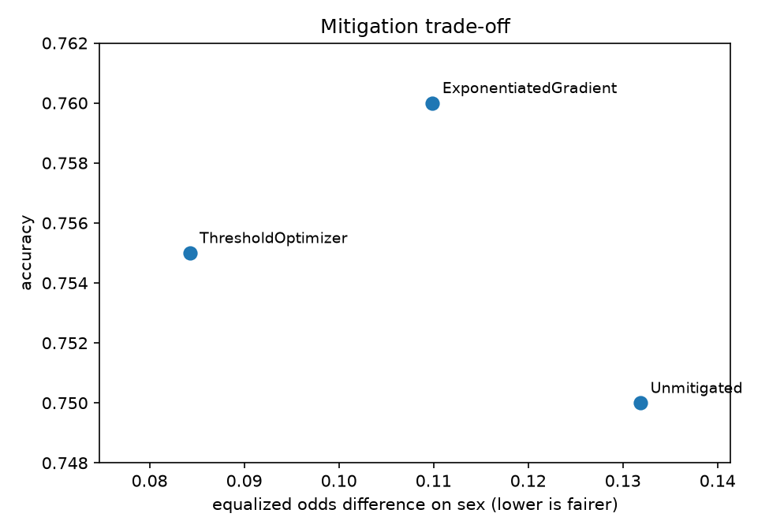
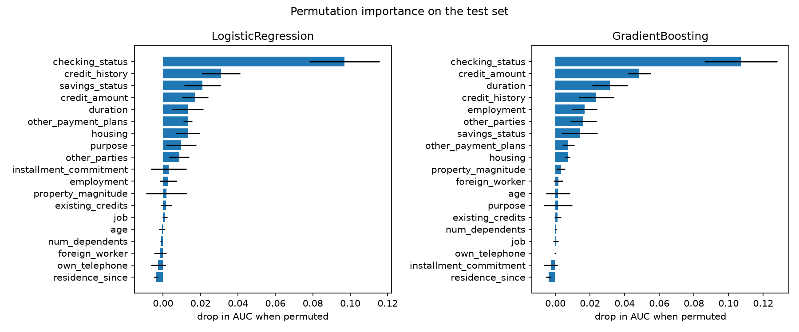
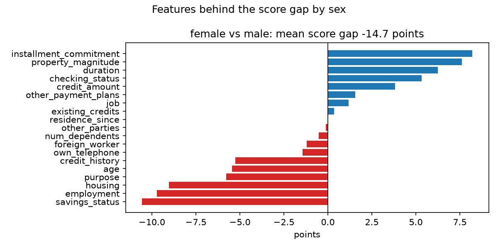

# FairScore audit: german_credit

1,000 rows, 19 features, 70.0% positive. Train 800, test 200. Sensitive attributes (sex, age_group) are held out of the features. All numbers below come from the test set unless stated.

## 1. Base rates

Share of positive outcomes in the raw labels, before any model.

| attribute | group | count | positive_rate |
| --- | --- | --- | --- |
| sex | female | 310 | 0.648 |
| sex | male | 690 | 0.723 |
| age_group | <=25 | 190 | 0.579 |
| age_group | >25 | 810 | 0.728 |

## 2. Proxy detection

Held-out AUC for predicting each sensitive attribute from the model features. 0.5 means the features carry no trace of it. Anything well above that means dropping the column did not remove the information.

| attribute | model | auc | top_features |
| --- | --- | --- | --- |
| sex | LogisticRegression | 0.732 | num_dependents, savings_status_>=1000, savings_status_500<=X<1000 |
| sex | RandomForest | 0.735 | age, credit_amount, duration |
| age_group | LogisticRegression | 0.991 | age, job_high qualif/self emp/mgmt, checking_status_>=200 |
| age_group | RandomForest | 1.000 | age, credit_amount, housing_rent |

## 3. Models

| model | auc | ks | brier | accuracy |
| --- | --- | --- | --- | --- |
| LogisticRegression | 0.781 | 0.452 | 0.168 | 0.750 |
| GradientBoosting | 0.795 | 0.462 | 0.164 | 0.755 |

Scores use 50 points to double the odds, with 600 at odds 1.0:1. Applicants at or above 600 (probability 0.50) are approved.

Largest scorecard weights (numeric points are per standard deviation):

| feature | coefficient | points |
| --- | --- | --- |
| (base points) | 2.07 | 749.01 |
| purpose_used car | 1.00 | 72.10 |
| checking_status_no checking | 0.89 | 63.92 |
| savings_status_>=1000 | 0.85 | 61.06 |
| credit_history_critical/other existing credit | 0.79 | 56.64 |
| purpose_new car | -0.78 | -56.29 |
| foreign_worker_yes | -0.75 | -54.02 |
| purpose_education | -0.75 | -53.77 |
| foreign_worker_no | 0.74 | 53.04 |
| employment_4<=X<7 | 0.69 | 50.07 |
| credit_history_all paid | -0.69 | -49.67 |

## 4. Fairness audit

`dp_ratio` is the lowest group approval rate divided by the highest. Below 0.8 fails the four-fifths rule. `eo_difference` is the larger of the TPR and FPR gaps.

| model | attribute | dp_difference | dp_ratio | eo_difference | passes_four_fifths |
| --- | --- | --- | --- | --- | --- |
| LogisticRegression | sex | 0.029 | 0.963 | 0.132 | yes |
| LogisticRegression | age_group | 0.073 | 0.906 | 0.125 | yes |
| GradientBoosting | sex | 0.051 | 0.933 | 0.039 | yes |
| GradientBoosting | age_group | 0.108 | 0.860 | 0.062 | yes |

Per-group detail for the scorecard:

| attribute | group | count | selection_rate | tpr | fpr | accuracy | mean_score |
| --- | --- | --- | --- | --- | --- | --- | --- |
| sex | female | 62 | 0.790 | 0.878 | 0.619 | 0.710 | 677.252 |
| sex | male | 138 | 0.761 | 0.869 | 0.487 | 0.768 | 688.471 |
| age_group | <=25 | 38 | 0.711 | 0.773 | 0.625 | 0.605 | 646.573 |
| age_group | >25 | 162 | 0.784 | 0.890 | 0.500 | 0.784 | 694.006 |

### Age threshold sensitivity

The audit splits age at 25. The same scorecard decisions, regrouped at other cut points:

| threshold | n_young | dp_difference | dp_ratio | eo_difference | passes_four_fifths |
| --- | --- | --- | --- | --- | --- |
| 22 | 11 | 0.045 | 0.941 | 0.291 | yes |
| 25 | 38 | 0.073 | 0.906 | 0.125 | yes |
| 28 | 66 | 0.086 | 0.892 | 0.144 | yes |
| 30 | 82 | 0.086 | 0.894 | 0.118 | yes |
| 35 | 119 | 0.096 | 0.884 | 0.102 | yes |
| 40 | 148 | 0.155 | 0.825 | 0.143 | yes |

## 5. Mitigation

Both methods target equalized odds on `sex`. ThresholdOptimizer needs `sex` at decision time. ExponentiatedGradient needs it only in training.

| method | accuracy | approval_rate | dp_difference | dp_ratio | eo_difference | passes_four_fifths |
| --- | --- | --- | --- | --- | --- | --- |
| Unmitigated | 0.750 | 0.770 | 0.029 | 0.963 | 0.132 | yes |
| ThresholdOptimizer | 0.755 | 0.765 | 0.060 | 0.926 | 0.084 | yes |
| ExponentiatedGradient | 0.760 | 0.760 | 0.021 | 0.973 | 0.110 | yes |

## 6. Explanations

Features behind the mean score gap on `sex`. The bars sum to the gap.

Sample reason codes for declined applicants (points lost against the average training applicant):

| applicant | points_vs_average | reason_1 | reason_2 | reason_3 |
| --- | --- | --- | --- | --- |
| 829 | -123.9 | duration (-62) | checking_status (-37) | property_magnitude (-36) |
| 985 | -100.1 | checking_status (-55) | housing (-27) | installment_commitment (-22) |
| 387 | -98.7 | checking_status (-37) | employment (-30) | credit_amount (-26) |
| 166 | -108.0 | checking_status (-55) | employment (-30) | installment_commitment (-22) |
| 650 | -190.5 | duration (-62) | checking_status (-55) | purpose (-44) |
| 141 | -176.3 | checking_status (-37) | property_magnitude (-36) | duration (-35) |
| 197 | -145.3 | existing_credits (-38) | checking_status (-37) | housing (-27) |
| 917 | -124.8 | credit_amount (-73) | checking_status (-55) | purpose (-46) |
| 191 | -115.9 | duration (-62) | checking_status (-37) | property_magnitude (-36) |
| 919 | -118.0 | checking_status (-55) | housing (-27) | installment_commitment (-22) |

## Caveats

- `sex=female` has 62 test rows. Its rates move several points on a handful of applicants.
- `age_group=<=25` has 38 test rows. Its rates move several points on a handful of applicants.
- Raw `age` is a model feature while `age_group` is audited, so the model can condition on age directly. Its proxy AUC near 1.0 is expected.
- Holding sensitive columns out does not hide them. `sex` is recoverable from the features at AUC 0.73.
- Mitigated predictions are randomized. Rerunning with another random_state shifts the mitigation rows slightly.
